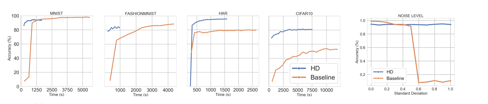

# FedHD - Federated Learning with Hyperdimensional Computing

This repository is the official implementation of FedHD [Link(TBA Paper under review)](). 


## Aim / Motivation

An edge-device friendly, efficient and robust Federated Learning System using Hyperdimensional Computing.

## Requirements

To install requirements:

```setup
pip install -r requirements.txt
```

## Training

FedHD use Mosquitto(https://mosquitto.org/) MQTT broker for communication and broadcasting.

### Start MQTT Broker
Go to **FedML-Server-HD/executor/mqtt/**
Start server MQTT broker:
```MQTT Broker
bash run_mosquitto_server.sh
```
Note: Before start MQTT broker, one might want to change MQTT configration (IP, Port), you can do so by change **/FedML-Server-HD/executor/mqtt/mosquitto.conf**.


### Start FedHD Broker
Go to **FedML-Server-HD/executor/** :
```FedHD Server
python app_HD.py [--options]
```
You can change server default options by pass in flag or modify file directly, for complete hyper-parameter list are listed in **app_HD.py**.
Please make sure MQTT IP and Port matches MQTT configration.


### Start FedHD Clients
To start clients, go to **FedML-IoT-HD/raspberry_pi/fedhd/** and run
```FedHD Client
python fedhd_rpi_client.py --server_ip XXX.XXX.XXX.XXX:XXXX --client_uuid XX 
```
Note: client uuid must be unique.


## Evaluation
\
1 - Hidden Layer\
2 - Fully Connected Layer


## Results
\



## Acknowledgement
FedHD are implemented based on [FedML](https://fedml.ai/), an open-source Federated Learning framework.


